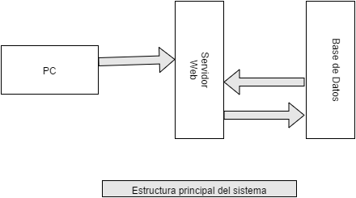
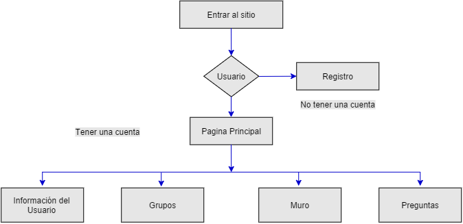

#Introducción

Las **Redes sociales** es la forma de comunicación del siglo 21. Las redes sociales son la agrupación de individuos en grupos específicos, como las pequeñas comunidades rurales o una subdivisión barrio. Aunque las redes sociales es posible en persona, sobre todo en los lugares de trabajo, universidades y escuelas secundarias, es más popular en línea. Esto es porque a diferencia de la mayoría de las escuelas secundarias, colegios o centros de trabajo, internet está lleno de millones de personas que están buscando para conocer a otras personas. A continuación un diagrama del flujo del sistema que se estará implemetando.

Una red social es la cartografía y la medición de las relaciones y los flujos entre las personas, los grupos, las organizaciones, las computadoras, las direcciones URL y otras entidades la información / conocimiento conectados. Los **nodos** de la red son las personas y los grupos, mientras que los enlaces muestran **relaciones** o flujos entre los nodos. Red social proporciona un visual y un análisis matemático de las relaciones humanas.

El proyecto mismo de una aplicación o sitio web de redes sociales, es un proyecto enorme que comprende varias características como el perfil de la actualización, la organización de la lista de amigos y otras aplicaciones para mejorar el aspecto general de la página web. Sin embargo, en este proyecto, básicamente se trabaja en cuatro partes esenciales; que son: Usuario, Grupos, Preguntas y Respuestas. Dentro de usuario, se manejan elementos como el perfil y sus calificaciones a cada respuesta; Estos comentarios son bien visibles y accesibles para cualquier persona que tenga acceso a ese perfil. Dentro de los grupos, se maneja la organización de los amigos afines acada categoria de los grupos; cada uno de estos incisos, se tienen elementos de gestión. En la grafica siguiente, mostramos como se realizan los procesos en la red social.

## Usuario

Esta entidad, debe realizar los siguientes pasos para su registro: 

1. Al ingresar al portal, el usuario debera ingresar sus credenciales (nombre de usuario y contraseña asociada) para poder entrar o salir del 
portal.

2. Dentro del portal, el usuario puede crear su perfil (breve descripción de la persona y foto), realizar cambios en este, suscribe a diferentes categorias (gustos académicos u otros), aderirse a múltiples grupos y también crearlos.

3. El usuario tendrá la posibilidad de hacer preguntas en las diferentes categorias, ver las respuestas a sus preguntas y las respuestas a las preguntasa de otros usuarios. 

## Grupos

Cada grupo tendrá un nombre asociado y múltiples usuarios suscritos. Los integrantes de un grupo, pueden interactuar, haciendo preguntas dentro de su grupo o fuera de él. Habrá un administrador del grupo que será el creador(dueño del perfil).

## Preguntas

Las preguntas serán categorizadas por área de interes; estarán formadas por un título, y su descripción. Cada pregunta puede ser editada y eliminada por su autor.

## Respuestas

En la campo de las respuestas, pueden intervenir todos los usuarios y unicamente podrán ser editadas o eliminadas por su autor.

## Development Frameworks

a. Hardware Requirements

1. Processor -- Intel Pentium IV 2.0 GHz and above
2. RAM		-- 	512 MB and above
3. Hard disk	--	80GB and above
4. Monitor	--	CRT or LCD monitor
5. Keyboard	--	Normal or Multimedia
6. Mouse		--	Compatible mouse

b. Software Requirements

1. PHP Framework -- CodeIgniter
2. DBMS -- Mysql
3. Operation System 	-- 	Windows XP or above, Linux
4. Brauser -- Chrome, Firefox or Safary

